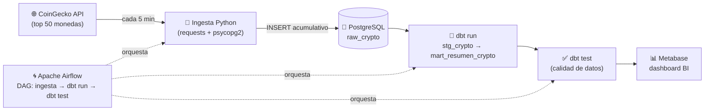

# 🚀 Crypto Data Pipeline — Modern Data Stack

Pipeline de datos **end-to-end, 100% contenerizado**, que ingesta el mercado de criptomonedas desde la API pública de [CoinGecko](https://www.coingecko.com/es/api) cada 5 minutos, lo transforma con dbt y lo sirve en un dashboard de BI. Un ciclo ELT completo con el *modern data stack*: **Airflow → PostgreSQL → dbt → Metabase**.



## 🏗️ Arquitectura

| Capa | Herramienta | Qué hace |
|------|-------------|----------|
| **Ingesta** | Python (`requests`, `psycopg2`) | Consulta la API de CoinGecko (top 50 por capitalización) e inserta cada snapshot de forma **acumulativa e histórica**, con política de retención auto-limpiable de **90 días** |
| **Orquestación** | Apache Airflow | DAG con cron `*/5 * * * *`: ingesta → transformación → tests. Reintentos automáticos si la API parpadea, `max_active_runs=1` para que las ejecuciones no se pisen |
| **Transformación** | dbt Core | `stg_crypto` (staging tipado desde el `source` con *freshness* configurado) y `mart_resumen_crypto` (funciones de ventana: ranking de liquidez y *market share* global por snapshot) |
| **Calidad** | dbt tests | `not_null` y `accepted_values` sobre el mart en cada ejecución — el pipeline no se da por bueno sin pasar el control de calidad |
| **Visualización** | Metabase | Dashboard conectado a la capa de marts: dominancia de mercado, evolutivo de precios, sentimiento Alcista/Bajista/Estable |

### El mart en detalle

`mart_resumen_crypto` aplica funciones de ventana particionadas por snapshot (`extracted_at`):

- **`ranking_liquidez`** — `RANK() OVER (PARTITION BY extracted_at ORDER BY market_cap DESC)`: posición de cada moneda en su momento exacto.
- **`market_share_global`** — capitalización de la moneda dividida por la del mercado completo en ese snapshot: dominancia minuto a minuto.
- **`comportamiento_mercado`** — clasificación Alcista / Bajista / Estable según la variación de precio en 24h.

## ⚡ Puesta en marcha

Requisitos: Docker y Docker Compose.

```bash
# 1. Clonar y configurar credenciales
git clone https://github.com/fmr693/crypto-data-pipeline.git
cd crypto-data-pipeline
cp .env.example .env        # edita usuario/contraseña de Postgres

# 2. Levantar el stack completo
docker compose up -d

# 3. Activar el DAG 'pipeline_crypto_coingecko' en Airflow
```

| Interfaz | URL | Credenciales |
|----------|-----|--------------|
| Airflow | http://localhost:8080 | `admin` / `admin` |
| Metabase | http://localhost:3000 | se configura al primer arranque |
| CloudBeaver (SQL) | http://localhost:8978 | se configura al primer arranque |

A los 5 minutos del primer arranque ya hay datos en `raw_crypto`; cada ejecución añade ~50 filas nuevas al histórico y refresca los modelos de dbt.

## 📂 Estructura

```
crypto-data-pipeline/
├── docker-compose.yml      # Postgres + Airflow + dbt + Metabase + CloudBeaver
├── .env.example            # Plantilla de credenciales
├── dags/
│   └── pipeline_crypto.py  # DAG: ingesta → dbt run → dbt test
├── scripts/
│   └── ingestor.py         # Extract + Load acumulativo con retención de 90 días
└── dbt_proyecto/
    ├── dbt_project.yml
    ├── profiles.yml
    └── models/
        ├── sources.yml     # Source raw_crypto con freshness (warn 12h / error 24h)
        ├── stg_crypto.sql  # Staging tipado
        └── marts/
            ├── mart_resumen_crypto.sql  # Ventanas: ranking + market share
            └── schema.yml               # Tests de calidad
```

## 🧠 Decisiones de diseño

- **ELT, no ETL:** los datos crudos aterrizan tal cual en Postgres y toda la lógica vive en dbt — versionada, testeada y documentada como código.
- **Histórico acumulativo con retención:** cada snapshot se conserva (análisis temporal real), pero una limpieza automática de 90 días evita el crecimiento indefinido del almacenamiento.
- **Calidad como tarea del DAG:** `dbt test` es un paso más de la cadena — si los datos no cumplen el contrato del `schema.yml`, la ejecución queda marcada en Airflow.
- **Todo en contenedores:** reproducible en cualquier máquina con un solo `docker compose up`.
